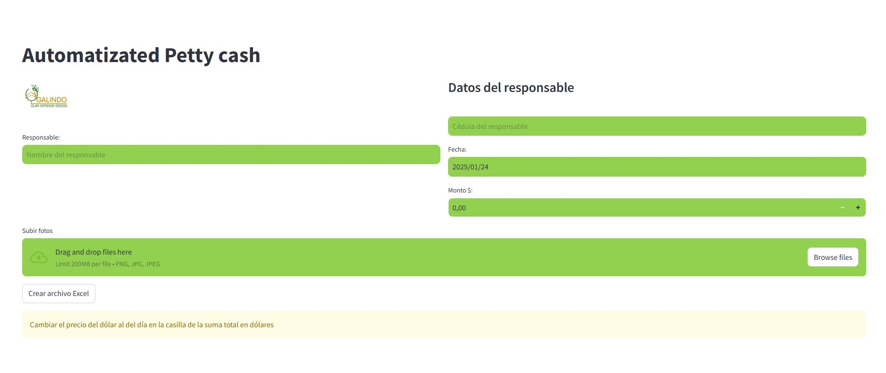

# Automatizated petty cash 
 
----


## Descripción
La aplicación Automatizated Petty Cash está diseñada para simplificar la gestión de fondos menores llamados cajas chicas en la compañia GALINDO GLAM INTERIOR DESIGN, permitiendo a los usuarios registrar y monitorear transacciones de manera eficiente y segura. Desarrollada usando Streamlit, esta herramienta proporciona una interfaz amigable y reportes personalizados para mantener un control financiero transparente.

## Capturas de Pantalla
### Inicio


## Características
- **Automatización de Transacciones:** Registro automático de ingresos y gastos mediante fotos de facturas.
- **Interfaz Intuitiva:** Fácil de usar para cualquier usuario, sin necesidad de conocimientos técnicos avanzados.
- **Reportes Personalizados:** Generación de informes detallados según las necesidades específicas del usuario.
- **Seguridad:** Protección de datos con protocolos de seguridad robustos.

## Uso personal

1. Abre la pagina `https://petty-cash-automatizated.streamlit.app/`
2. Activa la pagina porque esta inactiva mientras no se usa
3. Agrega tu nombre, cedula, monto, fecha(si es necesario)
4. Por ultimo agrega las fotos de tus facturas o pago movil realizados.
5. Dale en Crear Excel
6. Ahora dale en descargar caja chica
7. Asegurate que todo haya sido correctamente colocado en la caja chica y edita lo que no
8. Por ultimo y muy importante **Cambiar el precio del dólar al del día en la casilla de la suma total en dólares**

----
# Desarrolladores
----

## Instalación
```bash
# Clonar el repositorio
git clone https://github.com/Byirosaleshd/Automatizated-Petty-cash.git

# Entrar al directorio
cd Automatizated-Petty-cash

# Instalar dependencias
pip install -r requirements.txt

# Ejecutar la aplicación
streamlit run app.py
```

## Uso
1. Ejecuta la aplicación con el comando `streamlit run app.py`.
2. Abre tu navegador y navega a la dirección `http://localhost:8501`.
3. Sigue las instrucciones en pantalla para registrar y monitorear tus transacciones.

## Requisitos Previos
- Python 3.x
- Streamlit
- Otros paquetes especificados en `requirements.txt`


## Contribución
Las contribuciones son bienvenidas. Si deseas colaborar, por favor sigue estos pasos:
1. Realiza un fork del repositorio.
2. Crea una nueva rama (feature/nueva-funcionalidad).
3. Realiza tus cambios y haz commit (`git commit -m 'Añadir nueva funcionalidad'`).
4. Envía un pull request.

## Licencia
Este proyecto está licenciado bajo los términos de la licencia MIT. Para más detalles, consulta el archivo [LICENSE](LICENSE).

## Contacto
Para preguntas o sugerencias, por favor contacta por medio de github.


---


---

⌨️ con ❤️ por [Iro](https://github.com/Byirosaleshd) 😊


